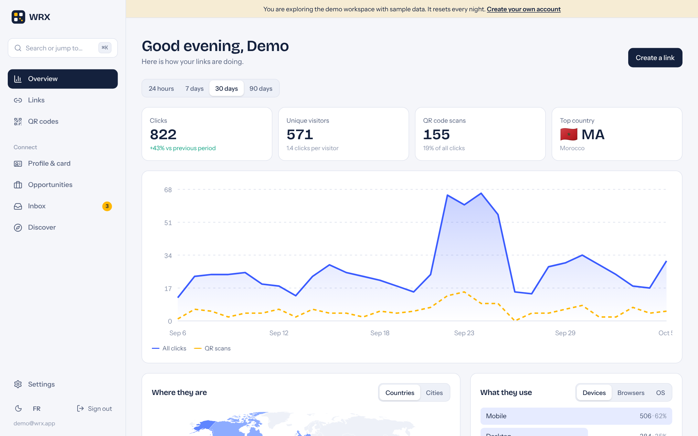
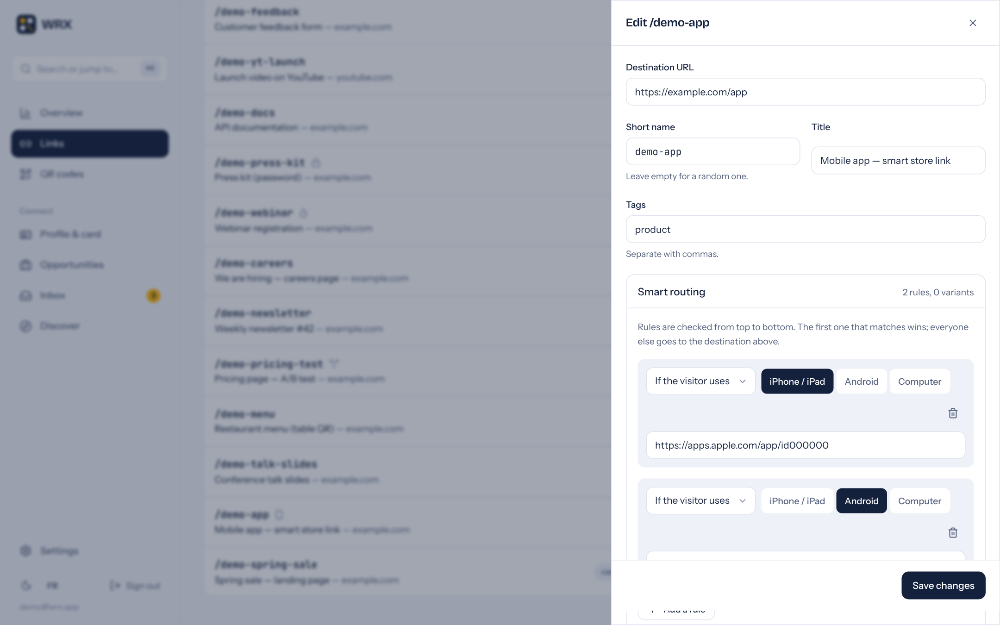
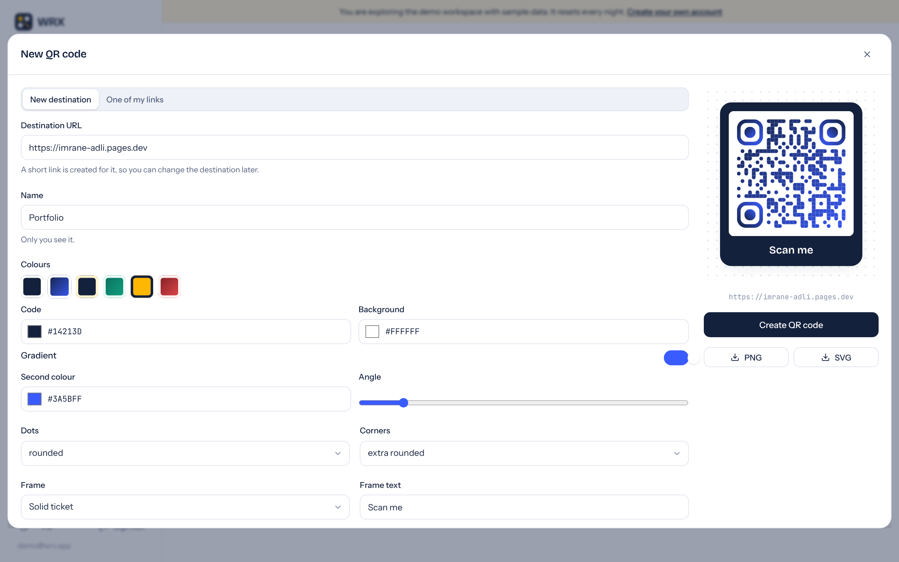
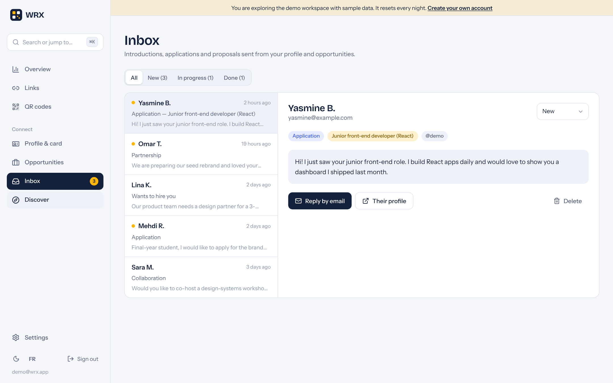
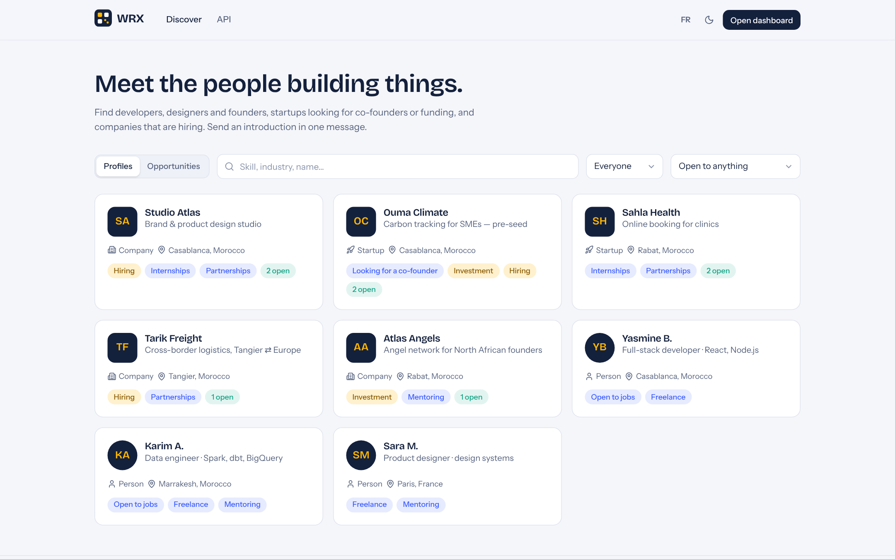
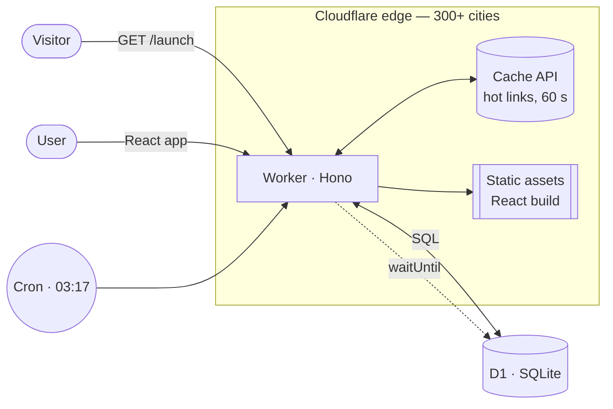

<div align="center">


# WRX

**Smart short links, dynamic QR codes, real-time analytics — and a professional network built on top.**

[](https://github.com/ADLI-Imrane/wrx-generator-v2/actions/workflows/ci.yml)


[**Live demo**](#live-demo) · [API reference](#public-api) · [Architecture](#architecture) · [Run it locally](#run-it-locally)



</div>

## What it does

WRX turns one link into a small routing engine and tells you who used it.

|                         |                                                                                                                                                                                                                                                                |
| ----------------------- | -------------------------------------------------------------------------------------------------------------------------------------------------------------------------------------------------------------------------------------------------------------- |
| **Smart links**         | Custom short names, tags, password protection, expiry dates and click limits, UTM tags applied to every destination.                                                                                                                                           |
| **Routing at the edge** | Send iPhone visitors to the App Store, Android to Google Play, visitors from Morocco to a French page — decided in the Cloudflare data centre closest to the visitor, before the page loads.                                                                   |
| **A/B tests**           | Split traffic between up to five destinations by weight and compare them in analytics.                                                                                                                                                                         |
| **QR studio**           | Colours, gradients, dot and corner styles, your logo, frames, PNG/SVG export. Every code is _dynamic_: it encodes a short link, so printed codes keep working when the destination changes.                                                                    |
| **Real-time analytics** | Clicks and unique visitors, a world map, cities, devices, browsers, operating systems, referring sites and channels, QR scans, top links and a live feed — computed in a single D1 batch.                                                                      |
| **Connect**             | Every profile is a public page, a vCard business card and a contact form. People, startups and companies appear in a searchable directory; they publish jobs, internships, partnerships and funding calls; every introduction lands in an inbox with a status. |
| **For developers**      | Documented REST API (OpenAPI 3.1, Swagger UI), API keys hashed at rest, CSV import of up to 500 links.                                                                                                                                                         |
| **Everything else**     | ⌘K command palette, dark mode, French and English, keyboard and screen-reader friendly, responsive down to small phones.                                                                                                                                       |

<table>
  <tr>
    <td></td>
    <td></td>
  </tr>
  <tr>
    <td></td>
    <td></td>
  </tr>
</table>

## Live demo

Open the app and press **Explore the live demo**: you land in a workspace with 12 links, ~2,500 clicks over 90 days, QR codes, a company profile with open roles, a directory of sample startups and an inbox. It is rebuilt every night by a Cron Trigger, so feel free to click everything.

## Architecture



- **One Worker, one origin.** The same Worker serves the React app, the `/api/v1` REST API and the short links at the root (`/launch`). Cookies stay first-party and there is no CORS to configure.
- **The redirect never waits for analytics.** The destination is chosen (rules → A/B split → default, then UTM) and the `302` is returned; the click is written to D1 afterwards with `ctx.waitUntil`.
- **Hot links are cached** in the per-colo Cache API (free, no KV write quota). Links with a click limit always read fresh counts.
- **Privacy by design.** No IP addresses are stored: unique visitors are counted with a daily-rotating SHA-256 of IP + user agent + link.
- **One schema, two runtimes.** Zod schemas in `packages/shared` validate requests in the Worker, power the forms in the browser and generate the OpenAPI document.

Decisions are recorded as ADRs in [`docs/adr`](docs/adr).

```
apps/
  api/        Cloudflare Worker — Hono, D1 migrations, Vitest (runs inside workerd)
  web/        React 19 + Vite + TanStack Query + Tailwind 4, Playwright E2E
packages/
  shared/     Zod schemas, slug rules, user-agent parser — shared by both apps
docs/         ADRs and screenshots
```

## Quality

| Check           | Tooling                                                                                                                                                                                                                                                            |
| --------------- | ------------------------------------------------------------------------------------------------------------------------------------------------------------------------------------------------------------------------------------------------------------------ |
| Type safety     | TypeScript `strict` + `noUncheckedIndexedAccess` across the monorepo                                                                                                                                                                                               |
| API tests       | 35 integration and unit tests run **inside the Workers runtime** with a real D1 (`@cloudflare/vitest-pool-workers`): auth, isolation between users, rate limiting, routing rules, password links, click limits, API keys, vCards, the Connect inbox, the demo seed |
| Front-end tests | Vitest + Testing Library for components and helpers                                                                                                                                                                                                                |
| End-to-end      | Playwright on desktop and mobile: sign up → create a link → follow the redirect; the demo; contacting a startup                                                                                                                                                    |
| CI              | GitHub Actions runs typecheck, unit, integration and E2E tests on every push, then deploys `main`                                                                                                                                                                  |

Security notes: PBKDF2-SHA256 password hashing (100k iterations), constant-time comparisons, httpOnly SameSite cookies, JSON-only mutations against CSRF, API keys stored as SHA-256, per-IP limits on auth, unlock and contact endpoints, a honeypot on public forms, secure headers on the API.

## Public API

Create a key in **Settings → API keys**, then:

```bash
curl -X POST https://<your-worker>/api/v1/links \
  -H "Authorization: Bearer wrx_…" -H "Content-Type: application/json" \
  -d '{ "url": "https://example.com/launch", "slug": "launch",
        "rules": [{ "type": "device", "devices": ["ios"], "url": "https://apps.apple.com/…" }] }'
```

Interactive reference: `/api/v1/docs` · machine-readable: `/api/v1/openapi.json`.

## Run it locally

Requirements: Node 20+, pnpm 9.

```bash
pnpm install
echo 'JWT_SECRET="dev-secret"' > apps/api/.dev.vars
pnpm db:migrate:local          # creates the local D1 database
pnpm --filter @wrx/web build   # the Worker serves the built app
pnpm dev:api                   # http://localhost:8787
# or, for hot reload on the UI: pnpm dev:web (http://localhost:5173, proxies /api to the Worker)

pnpm test                      # API (workerd) + web unit tests
pnpm e2e                       # Playwright, starts the Worker for you
```

## Deploy (free tier)

1. `npx wrangler d1 create wrx` and paste the `database_id` into `apps/api/wrangler.jsonc`.
2. `npx wrangler secret put JWT_SECRET` (any long random string).
3. `pnpm run deploy` — builds the app, applies migrations and deploys the Worker.

Or connect the repository in **Cloudflare → Workers → Create → Import a repository** and let Workers Builds deploy every push.

## Author

Built by **Imrane Adli** — full-stack software engineer, Casablanca.
[Portfolio](https://imrane-adli.pages.dev) · [LinkedIn](https://www.linkedin.com/in/imrane-adli) · [GitHub](https://github.com/ADLI-Imrane)

MIT licensed.
